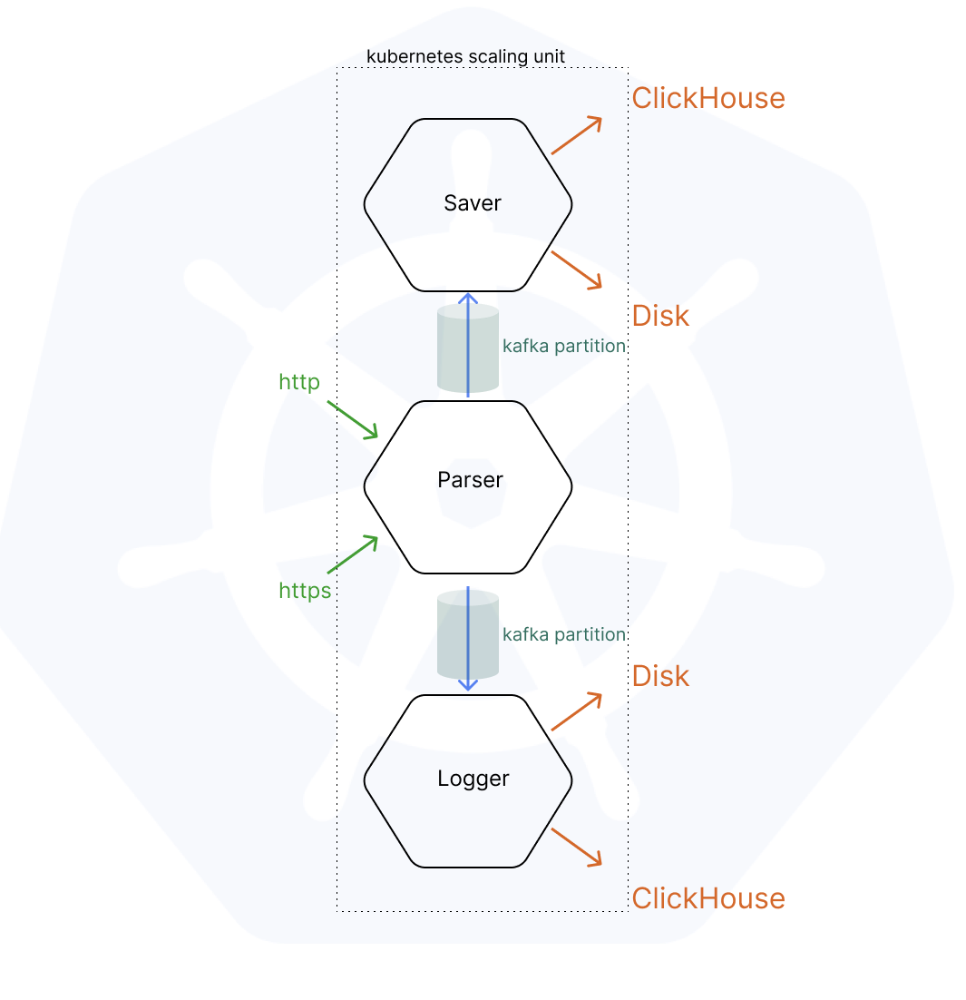

## Changelog 
- operation process refactored from being asyncronous to synchronous
- architecture switched from hexagonal to clean
- TLS pair generation moved to Dockerfile

## Under construction

#### What is highLoadParser?
It is version of [postParser](https://github.com/vynovikov/postParser) group adapted for high load.  Kubernetes is used for self-healing and autoscaling. Kafka is for highly performant communication. ClickHouse is for storing large amounts of metadata and logs.

#### Adaptation
Previously build [postParser](https://github.com/vynovikov/postParser) goes through adaptation steps:
- Multi-threading is removed. Processing uses single thread. For simplicity and kubernetes resource allocation clearance. Tuning for incoming load is provided by Kubernetes autoscaling
- gRPC transmitters/receivers are replaced with more performant Apache Kafka producers/consumers
- Parser obtains metric handling module necessary for autoscaling purposes
