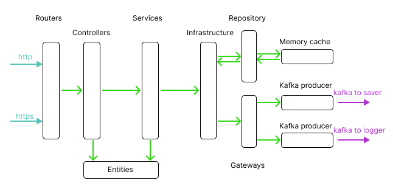
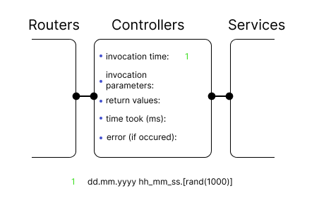

## Under construction

#### Changes
- operation process refactored from being asyncronous to synchronous
- architecture switched from hexagonal to clean
- gRPC transmitters replaced by kafka producers
- TLS pair generation moved to Dockerfile

#### What is highLoadParser?
It is version of [postParser](https://github.com/vynovikov/postParser) group adapted for high load.  Kubernetes is used for self-healing and autoscaling. Kafka is for highly performant communication. 

#### Architecture
HighLoadParser has clean architecture. Such architecture is redundant for a service of this scale and is chosen for study purposes

#### Structured logging
Every architecture layer records log element for every request.  Log chain is stored by logger service in json format for convenient    display using ELK

